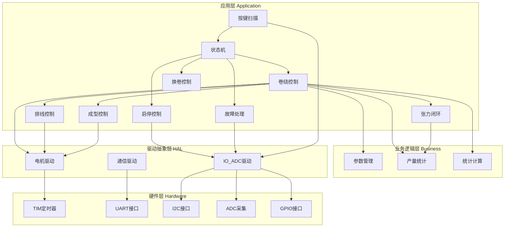
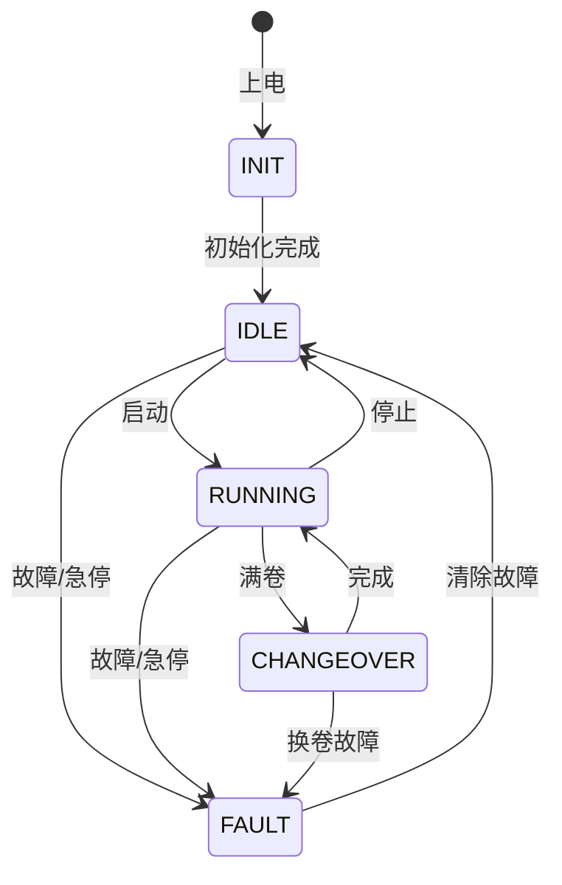
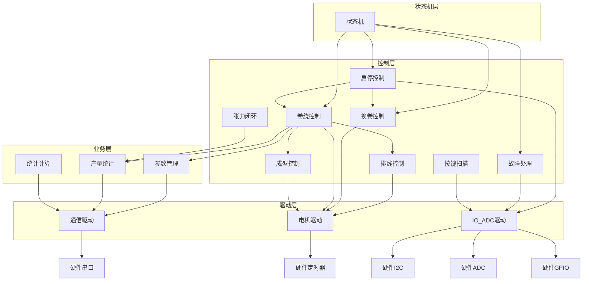
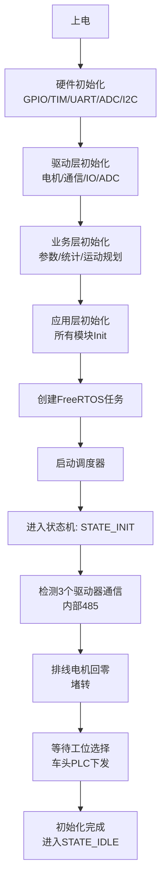

# 软件架构设计

**项目名称**: 丝线卷绕自动换卷控制系统
**版本**: v0.2
**创建日期**: 2026-03-27
**更新日期**: 2026-03-27

---

## 一、整体架构

### 1.1 分层设计



### 1.2 FreeRTOS任务划分

| 任务名称 | 优先级 | 周期 | 职责 |
|---------|--------|------|------|
| g_motorTask | 6 | 10ms | 电机控制（脉冲输出、方向控制、内部485通信） |
| g_tensionTask | 5 | 10ms | 张力闭环（PID计算、摆臂采样） |
| g_windingTask | 5 | 10ms | 卷绕控制（转速计算、启停控制） |
| g_changeoverTask | 3 | 10ms | 换卷控制（换卷动作、工位切换） |
| g_controlTask | 7 | 10ms | 启停控制（运行/停止逻辑） |
| g_faultTask | 8 | 10ms | 故障检测与处理 |
| g_commTask | 2 | 事件+10ms | 车头PLC通信（Modbus RTU） |
| g_statemachineTask | 1 | 10ms | 状态机（初始化/停机/运行/换卷/故障） |
| g_buttonTask | 3 | 50ms | 按键扫描（I2C IO扩展） |
| g_traverseTask | 9 | 1ms | 排线电机往复运动控制（高优先级） |
| g_shapingTask | 4 | 10ms | 排线动程计算（成型控制） |
| g_productionTask | 0 | 10ms | 产量统计（米长和直径） |
| g_statsTask | 0 | 10ms | 统计计算（产量、运行时间、满卷次数） |

**注**: 优先级数值越大优先级越高。

---

## 二、软件模块详细设计

### 2.1 电机模块 (Motor Module)

**职责**:
- 内部485通信收发（与3个驱动器交互）
- 转速到脉冲频率转换
- 脉宽处理（占空比控制）
- 方向控制（正反转）

**运行周期**: 10ms

**输入**:
- 电机ID（MOTOR_WINDING_A / MOTOR_WINDING_B / MOTOR_TRAVERSE / MOTOR_CHANGEOVER）
- 目标转速（RPM，正负表示方向）
- 使能状态（true/false）
- 脉冲反馈计数（DI采集）

**输出**:
- 脉冲频率输出（TIM PWM）
- 方向控制信号（GPIO）
- 内部485发送数据（UART）
- 实际转速（从脉冲反馈计算）

**接口**:

```c
// 电机初始化
void Motor_Init(void);

// 设置电机转速（脉冲频率）
// motorId: MOTOR_WINDING_A / MOTOR_WINDING_B / MOTOR_TRAVERSE / MOTOR_CHANGEOVER
// speedRPM: 转速（RPM），负值表示反转
void Motor_SetSpeed(uint8_t motorId, float speedRPM);

// 设置电机使能状态（通过内部485发送）
void Motor_SetEnable(uint8_t motorId, bool enable);

// 获取电机实际转速（从脉冲反馈计算）
float Motor_GetActualSpeed(uint8_t motorId);

// 10ms周期调用（内部485通信、状态更新）
void Motor_Task(void);
```

**数据结构**:

```c
typedef enum {
    MOTOR_WINDING_A = 0,  // 卷绕电机A
    MOTOR_WINDING_B = 1,  // 卷绕电机B
    MOTOR_TRAVERSE = 2,    // 排线电机
    MOTOR_CHANGEOVER = 3,  // 换卷步进电机
    MOTOR_MAX = 4
} MotorId_t;

typedef struct {
    float targetSpeed;       // 目标转速（RPM）
    float actualSpeed;       // 实际转速（RPM）
    bool isEnabled;         // 使能状态
    uint16_t pulseFreq;     // 脉冲频率（Hz）
    bool direction;         // 方向（true=正转，false=反转）
    uint16_t feedbackPulse;  // 反馈脉冲计数（用于计算转速）
} MotorContext_t;
```

**内部485通信**:
- 周期性发送使能命令、状态查询
- 接收驱动器响应（状态、故障、编码器值）
- 通信超时检测

---

### 2.2 张力闭环模块 (Tension Control Module)

**职责**:
- 摆臂位置模拟量采集（ADC）
- 张力PID控制计算
- 输出张力环调节系数（范围：[-1.1, 0.5]）

**运行周期**: 10ms

**输入**:
- 摆臂目标位置（ADC值）
- 摆臂实际位置（ADC采集）
- 张力Kp、Ki参数

**输出**:
- 张力环输出（范围：[-1.1, 0.5]）
- 摆臂当前位置（ADC值）

**控制逻辑**:

```
参考目标转速 = 放丝线速度 / (π × 实测卷绕直径 × 卷绕减速比)
实际输出转速 = 参考目标转速 × (1 + 张力环输出)
```

**接口**:

```c
// 张力控制初始化
void Tension_Init(void);

// 设置PID参数（由车头PLC下发）
void Tension_SetPID(float kp, float ki);

// 设置摆臂目标位置（模拟值）
void Tension_SetTargetPosition(float target);

// 10ms周期调用（PID计算）
void Tension_Task(void);

// 获取当前张力环输出（范围：[-1.1, 0.5]）
float Tension_GetOutput(void);

// 获取当前摆臂位置
float Tension_GetPosition(void);
```

**数据结构**:

```c
typedef struct {
    float kp;               // 比例系数
    float ki;               // 积分系数
    float targetPosition;    // 目标位置（摆臂中间）
    float currentPosition;  // 当前位置（ADC采集）
    float integral;         // 积分项
    float output;           // PID输出（范围：[-1.1, 0.5]）
} TensionContext_t;
```

**PID算法**:

```c
void Tension_Task(void) {
    float error = targetPosition - currentPosition;
    integral += error * 0.01f;  // 10ms周期，dt = 0.01s

    // 限制积分项
    if (integral > integralMax) integral = integralMax;
    if (integral < integralMin) integral = integralMin;

    output = kp * error + ki * integral;

    // 限幅到 [-1.1, 0.5]
    if (output > 0.5f) output = 0.5f;
    if (output < -1.1f) output = -1.1f;
}
```

---

### 2.3 卷绕控制模块 (Winding Control Module)

**职责**:
- 计算两个卷绕工位电机的参考目标转速
- 控制卷绕电机的启停
- 卷绕直径计算
- 米长统计

**运行周期**: 10ms

**输入**:
- 放丝线速度（车头PLC下发）
- 卷绕减速比（车头PLC下发）
- 当前工位（A/B）
- 卷绕电机实际转速（从电机模块获取）

**输出**:
- 卷绕直径（mm）
- 米长（m）
- 参考目标转速（RPM）

**接口**:

```c
// 卷绕控制初始化
void Winding_Init(void);

// 设置当前工位（A/B）
void Winding_SetStation(uint8_t stationId);

// 10ms周期调用（转速计算、直径计算、米长统计）
void Winding_Task(void);

// 获取卷绕直径
float Winding_GetDiameter(void);

// 获取米长
float Winding_GetLength(void);

// 检查是否满卷
bool Winding_IsFull(void);
```

**数据结构**:

```c
typedef struct {
    float diameter;          // 卷绕直径（mm）
    float length;           // 累计米长（m）
    float targetSpeed;      // 参考目标转速（RPM）
    bool isRunning;         // 是否运行
    uint8_t currentStation; // 当前工位（0=A, 1=B）
} WindingContext_t;
```

**转速计算**:

```c
void Winding_Task(void) {
    // 计算卷绕锭子转速（从当前工位电机获取）
    float spindleSpeed = Motor_GetActualSpeed(currentStation) * windingRatio;

    // 计算卷绕直径
    diameter = lineSpeed / (PI * spindleSpeed);

    // 计算参考目标转速
    targetSpeed = lineSpeed / (PI * diameter * windingRatio);

    // 米长统计
    length += lineSpeed * 0.01f;  // 10ms周期
}
```

---

### 2.4 换卷控制模块 (Changeover Control Module)

**职责**:
- 执行自动换卷动作
- 确定当前卷绕工位
- 速度匹配 + 张力切换

**运行周期**: 10ms

**输入**:
- 换卷触发信号（满卷检测）
- 当前工位
- 放丝线速度
- 空管直径
- 换卷步进电机行程
- 步进电机速度匹配阈值ε

**输出**:
- 当前工位（切换后）
- 换卷状态
- 换卷步进电机控制信号

**换卷流程**:

```
1. 启动待机工位电机（加速到目标速度）
2. 等待速度匹配完成（|V_B - V_目标| < ε）
3. 步进电机换卷（正向/反向旋转到预定位置）
4. 张力跟踪切换到新工位
5. 步进电机复位（反向旋转回原位）
6. 原工位停止
```

**接口**:

```c
// 换卷控制初始化
void Changeover_Init(void);

// 触发换卷动作
void Changeover_Trigger(void);

// 10ms周期调用（换卷状态机）
void Changeover_Task(void);

// 获取换卷状态
bool Changeover_IsBusy(void);

// 获取当前工位
uint8_t Changeover_GetCurrentStation(void);
```

**数据结构**:

```c
typedef enum {
    CHANGE_IDLE = 0,          // 空闲
    CHANGE_MATCHING = 1,       // 速度匹配中
    CHANGE_STEPPER_MOVE = 2,   // 步进电机换卷中
    CHANGE_TENSION_SWITCH = 3,  // 张力切换中
    CHANGE_RESET = 4,           // 步进电机复位中
    CHANGE_ERROR = 5            // 换卷故障
} ChangeoverState_t;

typedef struct {
    ChangeoverState_t state;
    uint8_t currentStation;    // 当前工位（0=A, 1=B）
    uint8_t standbyStation;     // 待机工位（0=A, 1=B）
    float matchTimeout;         // 速度匹配超时计数
    bool isBusy;
} ChangeoverContext_t;
```

---

### 2.5 启停控制模块 (Start/Stop Control Module)

**职责**:
- 确定系统运行状态
- 响应启动/停止按键
- 响应车头PLC启停指令

**运行周期**: 10ms

**输入**:
- 启动请求（按键）
- 停止请求（按键）
- 车头PLC启停指令
- 系统运行状态

**输出**:
- 系统运行状态（SYS_IDLE / SYS_RUNNING / SYS_STOPPING / SYS_ERROR）

**接口**:

```c
// 启停控制初始化
void StartStop_Init(void);

// 10ms周期调用（启停逻辑）
void StartStop_Task(void);

// 请求启动
void StartStop_RequestStart(void);

// 请求停止
void StartStop_RequestStop(void);

// 获取系统运行状态
bool StartStop_IsRunning(void);
```

**数据结构**:

```c
typedef enum {
    SYS_IDLE = 0,       // 待机
    SYS_RUNNING = 1,    // 运行中
    SYS_STOPPING = 2,   // 停止中
    SYS_ERROR = 3       // 故障
} SystemStatus_t;

typedef struct {
    SystemStatus_t status;
    bool startRequest;    // 启动请求
    bool stopRequest;     // 停止请求
    uint32_t stopTimer;   // 停止超时计时
} StartStopContext_t;
```

---

### 2.6 故障处理模块 (Fault Handling Module)

**职责**:
- 故障检测（过压、欠压、通信超时、换卷故障等）
- 故障状态管理
- 故障清除（车头PLC或按键）

**运行周期**: 10ms

**输入**:
- 母线电压（ADC采集）
- 通信状态（Modbus/内部485）
- 换卷状态
- 急停信号（按键）

**输出**:
- 故障码（bitfield）
- 故障状态

**故障类型**:

```c
typedef enum {
    FAULT_OVERVOLTAGE = 0x01,      // 母线过压（>60V）
    FAULT_UNDERVOLTAGE = 0x02,      // 母线欠压（<30V）
    FAULT_COMM_LOSS = 0x04,         // 485通信丢失
    FAULT_MOTOR_ERROR = 0x08,       // 电机驱动器故障
    FAULT_CHANGEOVER_ERROR = 0x10,  // 换卷失败
    FAULT_EMERGENCY_STOP = 0x20,     // 急停按下
    FAULT_TENSION_ERROR = 0x40      // 张力超限
} FaultCode_t;
```

**接口**:

```c
// 故障处理初始化
void Fault_Init(void);

// 10ms周期调用（故障检测）
void Fault_Task(void);

// 设置故障标志
void Fault_Set(FaultCode_t code);

// 清除故障标志
void Fault_Clear(FaultCode_t code);

// 清除所有故障
void Fault_ClearAll(void);

// 获取故障码
uint32_t Fault_GetCode(void);

// 检查是否有故障
bool Fault_IsActive(void);
```

---

### 2.7 车头通信模块 (PLC Communication Module)

**职责**:
- Modbus RTU通信（车头PLC ↔ 控制板）
- 接收PLC下发的参数
- 上报系统状态到PLC
- 状态更新周期10ms

**运行周期**: 事件驱动（PLC轮询时响应），状态更新10ms

**输入**:
- Modbus从站地址
- 寄存器读取请求
- 寄存器写入请求
- 系统状态（从各模块获取）

**输出**:
- PLC参数（卷绕减速比、线间距、放丝线速度等）
- 控制命令（启动、停止、换卷、清除故障）

**Modbus从站寄存器规划**（待细化）:

| 寄存器地址 | 类型 | 说明 |
|------------|------|------|
| 0x0000 | RO | 版本号 |
| 0x0001 | RO | 故障码 |
| 0x0002 | RO | 卷绕直径 |
| 0x0003 | RO | 米长 |
| 0x0004 | RO | 卷绕A转速 |
| 0x0005 | RO | 卷绕B转速 |
| 0x0006 | RO | 排线转速 |
| 0x0007 | RO | 摆臂位置 |
| 0x0008 | RO | 母线电压 |
| 0x0010 | RW | 卷绕减速比 |
| 0x0011 | RW | 线间距 |
| 0x0012 | RW | 排线减速比 |
| 0x0013 | RW | 放丝线速度 |
| 0x0014 | RW | 满卷直径 |
| 0x0015 | RW | 满卷米长 |
| 0x0016 | RW | 空管直径 |
| 0x0017 | RW | 空管动程 |
| 0x0018 | RW | 收边角度 |
| 0x0019 | RW | 张力Kp |
| 0x001A | RW | 张力Ki |
| 0x001B | RW | 摆臂目标位置 |
| 0x001C | RW | 换向裕度 |
| 0x0020 | RW | 控制命令（启动/停止/换卷/清除故障） |

**接口**:

```c
// 车头通信初始化
void Comm_Init(void);

// 10ms周期调用（状态更新）
void Comm_Task(void);

// 获取PLC下发的参数（由Modbus回调更新）
float Comm_GetParam(uint16_t paramId);

// 获取控制命令
uint16_t Comm_GetCommand(void);
```

---

### 2.8 状态机模块 (State Machine Module)

**职责**:
- 系统状态管理
- 状态转换逻辑
- 协调各模块工作

**运行周期**: 10ms

**输入**:
- 初始化完成信号
- 启动请求
- 停止请求
- 满卷检测
- 故障信号

**输出**:
- 当前系统状态（STATE_INIT / STATE_IDLE / STATE_RUNNING / STATE_CHANGEOVER / STATE_FAULT）

**状态定义**:

```c
typedef enum {
    STATE_INIT = 0,        // 初始化
    STATE_IDLE = 1,        // 停机（待机）
    STATE_RUNNING = 2,     // 运行
    STATE_CHANGEOVER = 3,  // 换卷
    STATE_FAULT = 4         // 故障
} SystemState_t;
```

**状态转换图**:



**接口**:

```c
// 状态机初始化
void StateMachine_Init(void);

// 10ms周期调用（状态转换）
void StateMachine_Task(void);

// 获取当前状态
SystemState_t StateMachine_GetState(void);

// 强制切换状态（用于故障处理）
void StateMachine_ForceState(SystemState_t state);
```

---

### 2.9 按键扫描模块 (Button Scan Module)

**职责**:
- I2C IO扩展芯片扫描（HTR3335）
- 按键去抖
- 按键事件检测（按下、释放、长按）

**运行周期**: 50ms

**输入**:
- HTR3335 IO状态（I2C读取）

**输出**:
- 按键事件（按下/释放/长按）
- LED控制状态

**接口**:

```c
// 按键扫描初始化
void Button_Init(void);

// 50ms周期调用（按键扫描）
void Button_Task(void);

// 获取按键状态
bool Button_IsPressed(uint8_t buttonId);

// 获取按键事件（按下/释放/长按）
uint8_t Button_GetEvent(uint8_t buttonId);
```

---

### 2.10 排线控制模块 (Traverse Control Module)

**职责**:
- 排线电机往复运动控制（梯形速度曲线）
- 方向控制（往复切换）
- 位置反馈处理

**运行周期**: 1ms（高优先级）

**输入**:
- 目标动程（角度，从成型模块获取）
- 换向裕度（车头PLC下发）
- 排线电机编码器反馈（可选）

**输出**:
- 排线电机转速（RPM）
- 排线方向（正/反）
- 当前位置（角度）

**接口**:

```c
// 排线控制初始化
void Traverse_Init(void);

// 1ms周期调用（往复运动控制）
void Traverse_Task(void);

// 获取排线当前位置（角度）
float Traverse_GetPosition(void);

// 获取排线方向
bool Traverse_GetDirection(void);
```

**数据结构**:

```c
typedef struct {
    float currentPosition;  // 当前位置（角度）
    float targetStroke;     // 目标动程（角度），由成型模块计算
    float velocity;         // 当前速度（角度/秒）
    bool direction;        // 往复方向（true=正向，false=反向）
    float margin;          // 换向裕度（由车头PLC下发）
} TraverseContext_t;
```

---

### 2.11 成型控制模块 (Shaping Control Module)

**职责**:
- 计算排线动程（随直径增加缩短）
- 收边角度处理（两边逐步缩短）
- 计算排线电机基准转速

**运行周期**: 10ms

**输入**:
- 空管动程（车头PLC下发）
- 收边角度（车头PLC下发）
- 卷绕直径（从产量统计模块获取）
- 卷绕减速比、线间距、排线减速比

**输出**:
- 排线动程（角度，传递给排线控制模块）
- 排线基准转速（RPM）

**接口**:

```c
// 成型控制初始化
void Shaping_Init(void);

// 10ms周期调用（动程计算）
void Shaping_Task(void);

// 获取排线动程（角度）
float Shaping_GetStroke(void);

// 获取排线基准转速（RPM）
float Shaping_GetTargetSpeed(void);
```

**数据结构**:

```c
typedef struct {
    float emptyStroke;      // 空管动程（角度），由车头PLC下发
    float edgeAngle;        // 收边角度（度），由车头PLC下发
    float currentStroke;     // 当前动程（角度），随直径变化
    float targetSpeed;      // 排线基准转速（RPM）
} ShapingContext_t;
```

---

### 2.12 产量统计模块 (Production Statistics Module)

**职责**:
- 米长统计
- 直径计算

**运行周期**: 10ms

**输入**:
- 放丝线速度（车头PLC下发）
- 卷绕电机实际转速（从电机模块获取）
- 系统运行状态

**输出**:
- 米长（m）
- 卷绕直径（mm）

**接口**:

```c
// 产量统计初始化
void Production_Init(void);

// 10ms周期调用（米长和直径计算）
void Production_Task(void);

// 获取米长
float Production_GetLength(void);

// 获取卷绕直径
float Production_GetDiameter(void);

// 重置统计数据
void Production_Reset(void);
```

**数据结构**:

```c
typedef struct {
    float length;       // 米长（m）
    float diameter;     // 卷绕直径（mm）
    uint32_t runTime;  // 运行时间（ms）
} ProductionContext_t;
```

---

### 2.13 统计计算模块 (Statistics Module)

**职责**:
- 产量统计
- 运行时间统计
- 满卷次数统计

**运行周期**: 10ms

**输入**:
- 系统运行状态
- 换卷完成次数

**输出**:
- 产量（件数）
- 运行时间（小时）
- 满卷次数

**接口**:

```c
// 统计初始化
void Stats_Init(void);

// 10ms周期调用（统计更新）
void Stats_Task(void);

// 获取产量
uint32_t Stats_GetProduction(void);

// 获取运行时间
uint32_t Stats_GetRunTime(void);

// 获取满卷次数
uint32_t Stats_GetFullCount(void);
```

---

### 2.14 参数管理模块 (Parameter Management Module)

**职责**:
- 管理所有运行参数
- 参数存储（Flash保存，可选）
- 参数有效性检查

**运行周期**: 事件驱动

**输入**:
- PLC下发的参数（Modbus接收）
- 参数设置命令

**输出**:
- 所有系统参数（供各模块读取）

**接口**:

```c
// 参数初始化（加载默认值或从Flash读取）
void Param_Init(void);

// 设置参数（带有效性检查）
bool Param_Set(uint16_t paramId, float value);

// 获取参数
float Param_Get(uint16_t paramId);

// 保存参数到Flash
void Param_Save(void);
```

---

## 三、关键时序

### 3.1 正常运行时序

**10ms周期任务**:

```mermaid
gantt
    title 正常运行时序（10ms周期）
    dateFormat X
    axisFormat %L

    section 10ms任务
    电机控制     :0, 10
    张力闭环     :10, 10
    卷绕控制     :20, 10
    启停控制     :30, 10
    成型控制     :40, 10
    换卷控制     :50, 10
    状态机       :60, 10
    产量统计     :70, 10
    统计计算     :80, 10
    故障处理     :90, 10
    通信状态     :100, 10
```



- Motor: 电机控制（10ms）
- Tension: 张力闭环（10ms）
- Winding: 卷绕控制（10ms）
- Start/Stop: 启停控制（10ms）
- Shaping: 成型控制（10ms）
- Changeover: 换卷控制（10ms）
- StateMachine: 状态机（10ms）
- Production: 产量统计（10ms）
- Stats: 统计计算（10ms）
- Fault: 故障处理（10ms）

**1ms周期任务**（高优先级，独立运行）:


- Traverse: 排线控制（1ms，最高优先级）

**50ms周期任务**:

```mermaid
gantt
    title 按键扫描时序（50ms周期）
    dateFormat X
    axisFormat %L

    section 50ms任务
    按键扫描     :0, 50
```



- Button: 按键扫描（50ms）

### 3.2 换卷时序

```
满卷检测 → 换卷触发 → 速度匹配 → 步进电机换卷 → 张力切换 → 步进复位 → 完成
  (10ms)    (10ms)      (500ms~1s)   (200ms)     (10ms)     (200ms)    (10ms)
```

---

## 四、模块依赖关系



---

## 五、初始化流程



---

## 六、总结

### 6.1 模块清单

| 模块名 | 周期 | 优先级 | 状态 |
|--------|------|--------|------|
| 电机模块 | 10ms | 6 | 你提出 |
| 张力闭环 | 10ms | 5 | 你提出 |
| 卷绕控制 | 10ms | 5 | 你提出 |
| 换卷控制 | 10ms | 3 | 你提出 |
| 启停控制 | 10ms | 7 | 你提出 |
| 故障处理 | 10ms | 8 | 你提出 |
| 车头通信 | 事件+10ms | 2 | 你提出 |
| 状态机 | 10ms | 1 | 你提出 |
| 按键扫描 | 50ms | 3 | 新增 |
| 排线控制 | 1ms | 9 | 新增（拆分） |
| 成型控制 | 10ms | 4 | 新增（拆分） |
| 产量统计 | 10ms | 0 | 新增（改名） |
| 统计计算 | 10ms | 0 | 新增 |
| 参数管理 | 事件驱动 | - | 新增 |

### 6.2 新增/拆分模块说明

1. **按键扫描模块**: 按键面板去抖和事件检测（HTR3335）
2. **排线控制模块**: 排线电机往复运动控制（1ms，高优先级），从原"排线控制"拆分
3. **成型控制模块**: 排线动程计算、收边角度处理、排线基准转速计算（10ms）
4. **产量统计模块**: 米长统计和直径计算（10ms），原名"统计计算"改为"产量统计"
5. **参数管理模块**: 集中管理所有PLC下发的参数
6. **统计计算模块**: 产量、运行时间、满卷次数统计

### 6.3 待完善事项

1. **Modbus寄存器详细映射**：需要明确每个参数的地址和类型
2. **内部485通信协议**：3个驱动器的具体协议待定
3. **HTR3335驱动**：待用户提供协议后实现
4. **排线往复运动算法**：梯形速度曲线的具体实现
5. **状态机详细逻辑**：每个状态下的具体操作和转换条件

### 6.4 模块输入输出汇总

| 模块 | 输入 | 输出 |
|------|------|------|
| 电机模块 | 电机ID、目标转速、使能状态、脉冲反馈计数 | 脉冲频率、方向、内部485数据、实际转速 |
| 张力闭环 | 摆臂目标位置、实际位置、Kp/Ki参数 | 张力环输出、摆臂当前位置 |
| 卷绕控制 | 放丝线速度、卷绕减速比、当前工位、电机实际转速 | 卷绕直径、米长、参考目标转速 |
| 换卷控制 | 换卷触发、当前工位、线速度、空管直径、阈值ε、步进行程 | 当前工位（切换后）、换卷状态、步进电机控制 |
| 启停控制 | 启动请求、停止请求、PLC指令、运行状态 | 系统运行状态 |
| 故障处理 | 母线电压、通信状态、换卷状态、急停信号 | 故障码、故障状态 |
| 车头通信 | Modbus从站地址、寄存器读写请求、系统状态 | PLC参数、控制命令 |
| 状态机 | 初始化完成、启动请求、停止请求、满卷、故障 | 当前系统状态 |
| 按键扫描 | HTR3335 IO状态 | 按键事件、LED控制 |
| 排线控制 | 目标动程、换向裕度、编码器反馈 | 电机转速、方向、当前位置 |
| 成型控制 | 空管动程、收边角度、卷绕直径、各减速比 | 排线动程、排线基准转速 |
| 产量统计 | 放丝线速度、电机实际转速、运行状态 | 米长、卷绕直径 |
| 统计计算 | 运行状态、换卷完成次数 | 产量、运行时间、满卷次数 |
| 参数管理 | PLC下发的参数、参数设置命令 | 所有系统参数 |
